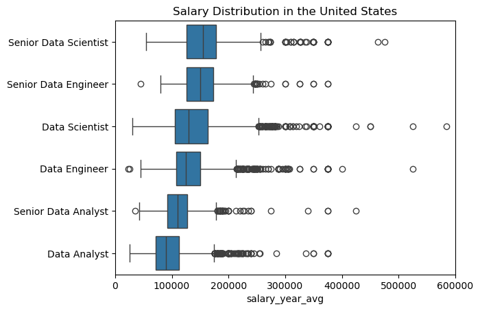
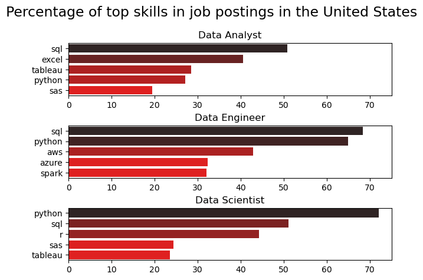
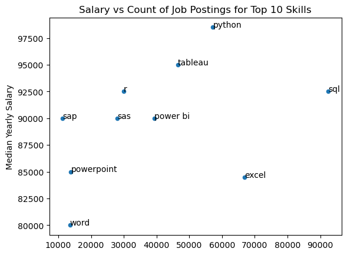
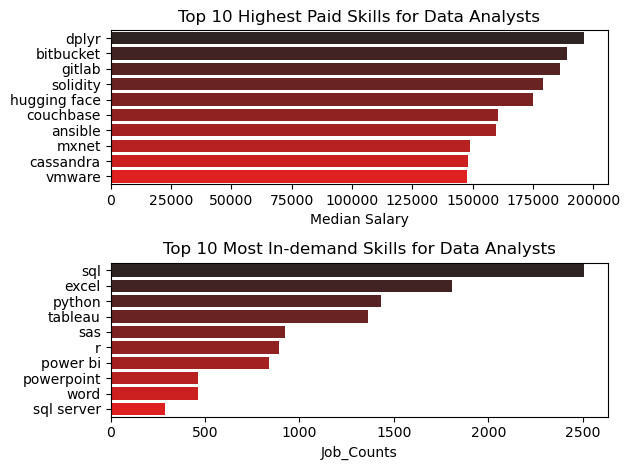
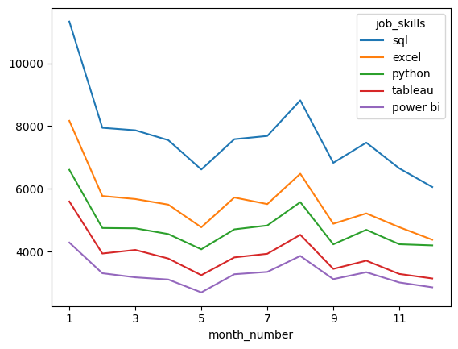

# Overview
The purpose of the study is to analyse job data, specifically for data analysis roles in the United States, so as to gain insight into the most paying jobs and skills, most demanded skills, and the most optimal jobs (high slary meets high demand skills).

# Background
The source of the dataset is [ Python for Data Analytics ]('lukebarousse/data_jobs'). It contains insights such as job title, salaries, locations and skills.

### The questions I wanted to ask through my SQL queries were :
1. What are the median salary for the top job titles in the United States ?

2. What are the most in-demand skills for data nalysts, data engineers and data scientists ?

3. What are the most optimal skills to learn for data analysts?

4. What are the top-paid and most in-demand skills for data analysts ?

5. What are the skills trend for data analysts?

# Tools I used
- **Python**: The backbone of my analysis, allowing me to analyze the data and find critical insights.I also used the following Python libraries:
  - **Pandas Library**: This was used to analyze the data.
  - **Matplotlib Library**: I used it to visualize the data.
  - **Seaborn Library**: Helped me create more advanced visuals.
  - **Jupyter Notebooks**: The tool I used to run my Python scripts which let me easily include my notes and analysis.
  - **Visual Studio Code**: My go-to for executing my Python scripts.
  - **Git & GitHub**: Essential for version control and sharing my Python code and analysis, ensuring collaboration and project tracking.

# Data Cleaning
## Import and Clean the Data
```python
# import libraries
import pandas as pd
import matplotlib.pyplot as plt
import ast
from datasets import load_dataset
import seaborn as sns

# load dataset
dataset = load_dataset('lukebarousse/data_jobs')
df = dataset['train'].to_pandas()


# clean dataset
df['job_posted_date'] = pd.to_datetime(df['job_posted_date'])
df['job_skills'] = df['job_skills'].apply(lambda x: ast.literal_eval(x) if pd.notna(x) else x)
```
## Filter the Data
This is so that I focus only on job postings in the United States.

```python
df_us = df[df['job_country'] == 'United States'].copy()
```
# Analysis
### 1. What are the median salary for the top job titles in the United States ?
I looked at and grouped the data by the  the top six job_title_shorts, and found the median salary for each job_title_short. I then used seaborn to generate the box plots for each.

```python
job_titles = df_us['job_title_short'].value_counts().index[:6].to_list()
job_titles

df_us_top_six = df_us[df_us['job_title_short'].isin(job_titles)]

sorted_jobs = df_us_top_six.groupby('job_title_short')['salary_year_avg'].median().sort_values(ascending=False).index

sns.boxplot(data=df_us_top_six, vert=False, x='salary_year_avg', y='job_title_short', order=sorted_jobs)

plt.title('Salary Distribution in the United States')
plt.ylabel('')
plt.xlim(0, 600000)
```
### Results

### Insights
- Data scientists and engineers earn more as compared to data analysts. It is therefore advisable for one to up- skill and specialize more  in case they want to earn more.

### 2. What are the most in-demand skills for data anlysts, data engineers and data scientists ?

I exploded the skills because they are in lists. I then grouped by the skills and found their size and sorted them in descending order.

```python
df_skills = df_us.explode('job_skills')
df_skills_grouped = df_skills.groupby(['job_skills','job_title_short']).size()
df_total_skills = df_skills_grouped.reset_index(name='total_skills_count')
df_final_skills = df_total_skills.sort_values(by='total_skills_count', ascending=False)
df_percentage = df_us['job_title_short'].value_counts().reset_index(name='total_job_counts')
df_skills_percentage = pd.merge(df_final_skills, df_percentage, how='left', on='job_title_short')
df_skills_percentage['skill_percent'] = 100 * df_skills_percentage['total_skills_count']/ df_skills_percentage['total_job_counts']

job_titles = ['Data Analyst', 'Data Engineer', 'Data Scientist']

fig, ax = plt.subplots(3,1)

for i, job_title in enumerate (job_titles):
   df_pivot =  df_skills_percentage[df_skills_percentage['job_title_short'] == job_title].head(5)
   #df_pivot.plot(kind='barh', x='job_skills', y='skill_percent', ax=ax[i], title = job_title)
   sns.barplot(data=df_pivot, x='skill_percent', y='job_skills', ax=ax[i], hue='skill_percent', palette='dark:r_r')
   ax[i].set_title(job_title)
   ax[i].set_ylabel('') 
   ax[i].set_xlabel('')
   ax[i].legend().set_visible(False)
   ax[i].set_xlim(0, 75)
fig.suptitle('Percentage of top skills in job postings in the United States', fontsize=17)
fig.tight_layout(h_pad=0.5)
plt.show()
```
### Results


### Inights
- SQL, Python, Excel and Tableau are must have skills for data analysts with SQL being the most in demand.
- SQL and Python are also very much in high-demand for data science and data engineer roles. 
- It is also important to learn cloud technology skills such as azure, aws and spark as they come in handy for data engineer roles.

### 3. What are the most optimal skills to learn for data analysts?

These are the most demanded and top paying skills as well. I used median salary to get the most paying skills.

```python
df_exploded =df_data_analysis_skills.explode('job_skills')

df_skills = df_exploded.groupby('job_skills').agg(
    skill_count = ('job_skills', 'count'),
    median_salary = ('salary_year_avg', 'median')
)

df_total_skill_count =df_skills.sort_values(by= 'skill_count', ascending=False).head(10)

df_total_skill_count.plot(kind='scatter', x='skill_count', y='median_salary')

for i,txt in enumerate(df_total_skill_count.index):
    plt.text(df_total_skill_count['skill_count'].iloc[i], df_total_skill_count['median_salary'].iloc[i], txt)

plt.xlabel('Count of Job Postings')
plt.ylabel('Median Yearly Salary')
plt.title('Salary vs Count of Job Postings for Top 10 Skills')
```
### Results


### Insights
- Python is the most optimal skill for a data analyst to learn.
- Other top conteders are tableau, R and SQL.
- One should also be familiar with BI tools ( power bi ), excel, and word. 

### 4. What are the top-paid and most in-demand skills for data analysts ?

```python
fig, ax = plt.subplots(2, 1)

# Highest paid
sns.barplot(data=df_top_paying, x='median', y=df_top_paying.index,
            ax=ax[0], palette='dark:r')
ax[0].set_title('Top 10 Highest Paid Skills for Data Analysts')
ax[0].set_ylabel('')
ax[0].set_xlabel('Median Salary')

# Most in-demand
df_popular_skills_sorted = df_popular_skills.sort_values(by='count', ascending= False)
sns.barplot(data=df_popular_skills_sorted, x='count', y=df_popular_skills_sorted.index,
            ax=ax[1], palette='dark:r')
ax[1].set_title('Top 10 Most In-demand Skills for Data Analysts')
ax[1].set_ylabel('')
ax[1].set_xlabel('Job_Counts')

fig.tight_layout()
```
### Results


### Insights
- Specialization skills which are not most-demanded for are the top-most-paying ones. It is thefefore safe to say that learning one of these skills could be very benefical.
- SQL, Excel, Python, Tableau are still the most in demand skills for data analysts although they are not the top paying.

### 5. What are the skills trend for data analysts?

I grouped the skills for 2023 by month so as to notice a pattern.

```python
df_data_analysis_explode_pivot = df_data_analysis_explode.pivot_table(
    index='month_number',
    columns='job_skills',
    aggfunc='size',
    fill_value=0
)

df_data_analysis_explode_pivot.loc['total'] = df_data_analysis_explode_pivot.sum()
df_data_analysis_explode_pivot = df_data_analysis_explode_pivot[df_data_analysis_explode_pivot.loc['total'].sort_values(ascending=False).index]

df_data_analysis_explode_pivot = df_data_analysis_explode_pivot.drop('total')
df_data_analysis_explode_pivot

df_data_analysis_explode_pivot.iloc[:,:5].plot(kind='line')
```
### Results


### Insights
- The peak for the skills - sql, excel, python, tablaeu and power bi - are in the motnhs of January and August. These implies that it is in this 2 months that most companies look for personnel with these skills.
- SQL was the most demanded (trending) skill for data analysts in 2023.

# Lessons Learnt
I learnt how to leverage python for data analysis. Using differnt libraries such as matplotlib, seaborn, and pandas to manipulate raw data.
I also learnt the skills I required to venture into the data analysis job market and the salary distributions for differnent roles.


